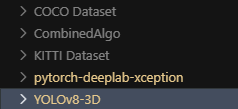

# Computer Vision Final Project

This project uses the KITTI dataset:

https://www.cvlibs.net/datasets/kitti/eval_object.php?obj_benchmark=3d

Mainly:
- 'Download left color images of object data set (12 GB)'
- 'Download camera calibration matrices of object data set (16 MB)'
- 'Download training labels of object data set (5 MB)'

It is best practice to create a separate conda environment for each algorithm if you want to test them individually.

## Things to note
- The code was run in Python 3.10
- It was run on CPU, not a dedicated GPU
- We used MobileNet for training as it is the smallest and fastest model for CPU use
- The dataset should be outside of the folder named 'KITTI Dataset' as shown

<div align="center">

</div>

## Installation

1. **Clone the repository:**
   ```conda
   git clone <your-repo-url>
   cd <repo-folder>
   ```

2. **Install [Miniconda/Anaconda](https://docs.conda.io/en/latest/miniconda.html) if you haven't already.**

3. **Create and activate a conda environment for each algorithm:**

   For CombinedAlgo:
   ```conda
   conda create -n combinedalgo python=3.10 -y
   conda activate combinedalgo
   pip install -r CombinedAlgo/requirements.txt
   ```

   For YOLOv8-3D:
   ```conda
   conda create -n yolov8-3d python=3.10 -y
   conda activate yolov8-3d
   # Install dependencies as needed
   ```

   For pytorch-deeplab-xception:
   ```conda
   conda create -n deeplab python=3.10 -y
   conda activate deeplab
   # Install dependencies as needed
   ```

4. **Download and organize the datasets as described above.**

## How to Run

- **To run the combined algorithm:**
  ```conda
  conda activate combinedalgo
  cd CombinedAlgo
  python run_combined.py
  ```

- **For YOLOv8-3D:**
  ```conda
  conda activate yolov8-3d
  cd YOLOv8-3D
  python demo.py
  ```

- **For DeepLab:**
  ```conda
  conda activate deeplab
  cd pytorch-deeplab-xception
  # Add your run command here, e.g.:
  # python train.py --eval
  ```

## Credits
- KITTI dataset: [link]
- COCO dataset: [link]
- DeepLab: [link]
- YOLOv8: [link]